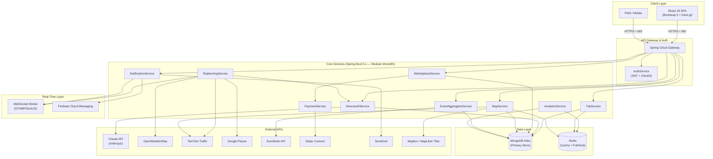
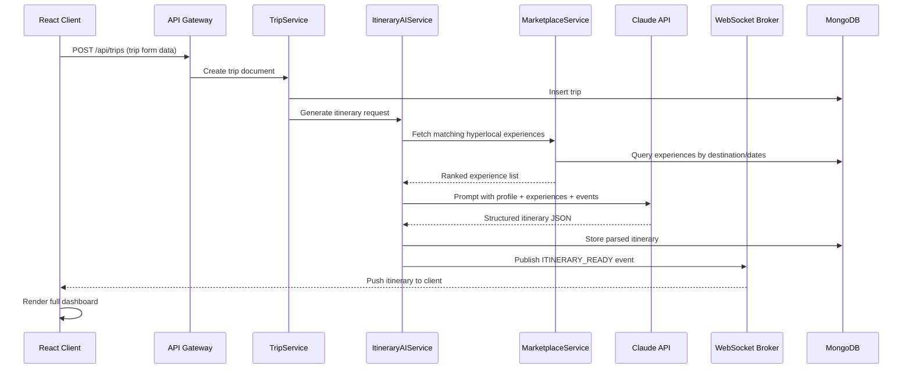
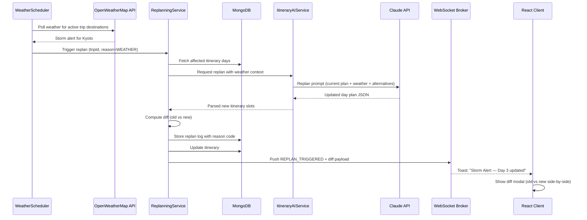
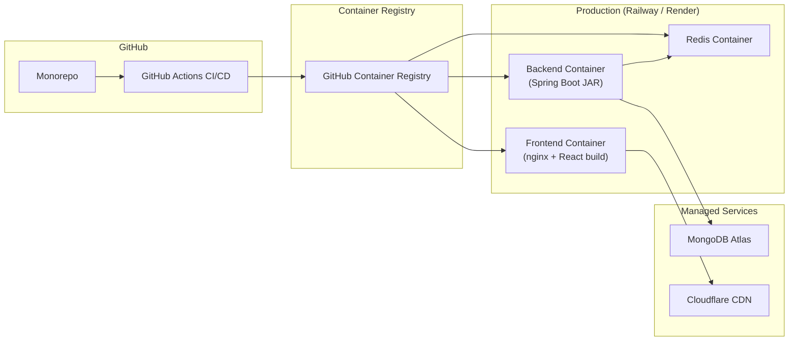

# LocalLens — System Architecture Overview

## Platform Vision

**LocalLens** is a two-sided hyperlocal travel marketplace that replaces the fragmented stack of Google Maps + Booking.com + TripAdvisor + Notes + Flight apps with a single AI-powered dashboard. It surfaces hyperlocal experiences from verified local creators and dynamically replans itineraries in real-time based on weather, traffic, and venue status.

---

## High-Level Architecture Diagram

---

## Service Communication Pattern

---

## Dynamic Replanning Flow

---

## Deployment Architecture

---

## Technology Decision Matrix

| Layer | Choice | Rationale |
|-------|--------|-----------|
| **Frontend** | React 18 + Bootstrap 5 | Component ecosystem + responsive grid, SSR-ready with Next.js migration path |
| **State** | Zustand + React Query | Lightweight client state + automatic server-state caching/invalidation |
| **Maps** | Deck.gl + MapLibre GL JS | Open-source 3D visualization, no Mapbox vendor lock-in, WebGL-powered |
| **Backend** | Spring Boot 3.x (Java 17) | Enterprise-grade, excellent MongoDB support, built-in WebSocket/STOMP |
| **Database** | MongoDB Atlas | Flexible schemas, GeoJSON native, GridFS for documents, TTL indexes |
| **Cache** | Redis | Sub-ms reads for heatmap data, session store, pub/sub for cross-service events |
| **AI** | Claude API (Anthropic) | Superior structured output, large context window for complex itineraries |
| **Payments** | Stripe Connect | Two-sided marketplace payouts, managed KYC, configurable commission |
| **Email** | SendGrid | Transactional email at scale, template engine, delivery tracking |
| **Real-time** | STOMP/SockJS + Firebase | WebSocket for web, FCM for mobile push, fallback to long-polling |
| **CI/CD** | GitHub Actions + Docker | Industry standard, container-native, free tier for open-source |

---

## Security Architecture

| Concern | Implementation |
|---------|----------------|
| **Authentication** | Spring Security + JWT (access 15min / refresh 7d) + OAuth2 (Google, Apple) |
| **Authorization** | Role-based: `TRAVELER`, `CREATOR`, `ADMIN` with method-level `@PreAuthorize` |
| **API Security** | Rate limiting (Bucket4j), CORS whitelist, CSRF for non-API routes |
| **Data Encryption** | TLS 1.3 in transit, MongoDB field-level encryption for PII |
| **Secrets** | Spring Cloud Vault or environment variables (never in code) |
| **Input Validation** | Bean Validation (JSR-380) on all DTOs, sanitized before Claude prompts |
| **File Upload** | MongoDB GridFS with virus scanning, max 10MB, allowed MIME types only |
