# LocalLens — React Frontend Architecture

> **Stack**: React 18 + Bootstrap 5 + Zustand + React Query + Deck.gl + MapLibre GL JS + @dnd-kit

---

## Project Structure

```
locallens-frontend/
├── public/
│   ├── index.html
│   ├── favicon.ico
│   ├── manifest.json              # PWA manifest
│   └── sw.js                      # Service worker (Phase 3)
├── src/
│   ├── index.js
│   ├── App.jsx                    # Root: router + providers
│   ├── components/
│   │   ├── common/                # Shared UI components
│   │   │   ├── Navbar.jsx
│   │   │   ├── Footer.jsx
│   │   │   ├── LoadingSpinner.jsx
│   │   │   ├── ErrorBoundary.jsx
│   │   │   ├── Toast.jsx
│   │   │   ├── Modal.jsx
│   │   │   ├── ConfirmDialog.jsx
│   │   │   ├── Avatar.jsx
│   │   │   ├── Badge.jsx
│   │   │   ├── Rating.jsx
│   │   │   ├── PriceDisplay.jsx
│   │   │   ├── DateRangePicker.jsx
│   │   │   ├── BudgetSlider.jsx
│   │   │   ├── TagSelector.jsx
│   │   │   ├── NotificationBell.jsx
│   │   │   └── DarkModeToggle.jsx
│   │   ├── auth/
│   │   │   ├── LoginForm.jsx
│   │   │   ├── RegisterForm.jsx
│   │   │   ├── OAuthButtons.jsx
│   │   │   └── ProtectedRoute.jsx
│   │   ├── trip/
│   │   │   ├── TripWizard.jsx           # Multi-step trip creation
│   │   │   ├── TripWizardStep1.jsx      # Destination + dates
│   │   │   ├── TripWizardStep2.jsx      # Budget + style + interests
│   │   │   ├── TripWizardStep3.jsx      # Group size + accessibility
│   │   │   ├── TripWizardStep4.jsx      # Review + submit
│   │   │   ├── TripCard.jsx             # Summary card for trip list
│   │   │   └── TripList.jsx
│   │   ├── dashboard/
│   │   │   ├── Dashboard.jsx            # Main layout orchestrator
│   │   │   ├── TripOverviewCard.jsx     # Dates, destination, budget gauge, weather
│   │   │   ├── ItineraryTimeline.jsx    # Day-view timeline with DnD
│   │   │   ├── ActivityCard.jsx         # Time / activity / transport / cost / status
│   │   │   ├── FlightsPanel.jsx
│   │   │   ├── AccommodationPanel.jsx
│   │   │   ├── BudgetTracker.jsx        # Category progress bars
│   │   │   ├── LocalEventsPanel.jsx     # Real-time event feed
│   │   │   ├── NotesDocumentsPanel.jsx  # Upload + view documents
│   │   │   ├── WeatherWidget.jsx
│   │   │   ├── MapWidget.jsx            # Embedded crowd heatmap
│   │   │   ├── ReplanModal.jsx          # Diff view: old vs new
│   │   │   ├── ReplanToast.jsx          # "Your day just changed" toast
│   │   │   └── PanelContainer.jsx       # Collapsible, reorderable wrapper
│   │   ├── map/
│   │   │   ├── MapView.jsx              # Full-screen Deck.gl + MapLibre
│   │   │   ├── HeatmapLayer.jsx         # Deck.gl HeatmapLayer wrapper
│   │   │   ├── POIMarkers.jsx           # Deck.gl IconLayer
│   │   │   ├── HiddenGemMarkers.jsx     # Deck.gl ScatterplotLayer
│   │   │   ├── RouteLayer.jsx           # Deck.gl PathLayer
│   │   │   ├── TrafficOverlay.jsx       # Deck.gl TripsLayer
│   │   │   ├── TimeSlider.jsx           # Filter by hour of day
│   │   │   ├── MapTooltip.jsx           # Hover tooltip for POIs
│   │   │   ├── MapFilterBar.jsx         # Right Now | Morning | Afternoon | Evening
│   │   │   └── AddToItineraryButton.jsx # Quick-add from map pin
│   │   ├── marketplace/
│   │   │   ├── ExperienceGrid.jsx       # Browse experiences
│   │   │   ├── ExperienceCard.jsx       # Card with image, price, rating
│   │   │   ├── ExperienceDetail.jsx     # Full detail page
│   │   │   ├── BookingForm.jsx          # Date, group size, payment
│   │   │   ├── ReviewList.jsx
│   │   │   ├── ReviewForm.jsx
│   │   │   ├── CreatorProfile.jsx       # Public creator profile page
│   │   │   └── SearchFilters.jsx        # Category, price, rating, distance
│   │   ├── creator/
│   │   │   ├── CreatorDashboard.jsx     # Creator-side overview
│   │   │   ├── ExperienceForm.jsx       # Create/edit experience
│   │   │   ├── AvailabilityCalendar.jsx # Set recurring/one-off slots
│   │   │   ├── BookingManagement.jsx    # Accept/decline/view bookings
│   │   │   ├── EarningsChart.jsx        # Revenue over time
│   │   │   ├── AIInjectionStats.jsx     # Which itineraries used their experience
│   │   │   ├── MessageInbox.jsx
│   │   │   └── PayoutHistory.jsx
│   │   └── messaging/
│   │       ├── ConversationList.jsx
│   │       ├── ChatWindow.jsx
│   │       └── MessageBubble.jsx
│   ├── pages/
│   │   ├── HomePage.jsx                 # Landing page with hero, features, CTA
│   │   ├── LoginPage.jsx
│   │   ├── RegisterPage.jsx
│   │   ├── TripCreatePage.jsx           # Trip wizard wrapper
│   │   ├── DashboardPage.jsx            # Dashboard wrapper
│   │   ├── MapPage.jsx                  # Full-screen map view
│   │   ├── ExplorePage.jsx              # Browse marketplace
│   │   ├── ExperienceDetailPage.jsx
│   │   ├── CreatorProfilePage.jsx
│   │   ├── CreatorDashboardPage.jsx
│   │   ├── MessagesPage.jsx
│   │   ├── SettingsPage.jsx
│   │   ├── NotFoundPage.jsx
│   │   └── AdminPage.jsx               # Admin analytics (Phase 3)
│   ├── hooks/
│   │   ├── useAuth.js                   # Auth state + login/logout/register
│   │   ├── useTrips.js                  # React Query: trip CRUD
│   │   ├── useItinerary.js              # React Query: itinerary data + mutations
│   │   ├── useReplan.js                 # WebSocket subscription for replans
│   │   ├── useExperiences.js            # React Query: experience search + booking
│   │   ├── useMap.js                    # Heatmap data, POIs, route
│   │   ├── useEvents.js                 # React Query: events feed
│   │   ├── useBookings.js               # React Query: booking management
│   │   ├── useNotifications.js          # WebSocket + REST notifications
│   │   ├── useMessages.js               # WebSocket + REST messages
│   │   ├── useWebSocket.js              # STOMP/SockJS connection manager
│   │   ├── useDarkMode.js               # Theme toggle
│   │   ├── useDebounce.js
│   │   └── useGeoLocation.js            # Browser geolocation API
│   ├── services/
│   │   ├── api.js                       # Axios instance with JWT interceptor
│   │   ├── authService.js               # /api/auth/* calls
│   │   ├── tripService.js               # /api/trips/* calls
│   │   ├── itineraryService.js          # /api/itinerary/* calls
│   │   ├── experienceService.js         # /api/experiences/* calls
│   │   ├── creatorService.js            # /api/creator/* calls
│   │   ├── paymentService.js            # /api/payments/* calls
│   │   ├── mapService.js                # /api/map/* calls
│   │   ├── eventService.js              # /api/events/* calls
│   │   ├── notificationService.js       # /api/notifications/* calls
│   │   ├── messageService.js            # /api/messages/* calls
│   │   └── websocketService.js          # STOMP client setup + subscriptions
│   ├── store/
│   │   ├── authStore.js                 # Zustand: user, tokens, login state
│   │   ├── tripStore.js                 # Zustand: active trip, selected day
│   │   ├── mapStore.js                  # Zustand: viewport, layers, filters
│   │   ├── uiStore.js                   # Zustand: dark mode, panel order, modals
│   │   └── notificationStore.js         # Zustand: unread count, toast queue
│   ├── utils/
│   │   ├── constants.js                 # API URLs, enums, config
│   │   ├── formatters.js                # Date, currency, time formatting
│   │   ├── validators.js                # Form validation helpers
│   │   └── mapUtils.js                  # Viewport helpers, layer configs
│   └── styles/
│       ├── index.css                    # Global styles + Bootstrap overrides
│       ├── variables.css                # CSS custom properties + dark mode
│       ├── dashboard.css
│       ├── map.css
│       ├── marketplace.css
│       └── animations.css               # Transitions + micro-animations
├── .env                                  # REACT_APP_API_URL, MAPLIBRE_KEY, etc.
├── package.json
├── vite.config.js                        # Vite config
└── README.md
```

---

## Component Tree (Simplified)

```mermaid
graph TD
    App["App.jsx"]
    App --> Navbar
    App --> Router["React Router"]

    Router --> HP["HomePage"]
    Router --> LP["LoginPage"]
    Router --> RP["RegisterPage"]
    Router --> TCP["TripCreatePage"]
    Router --> DP["DashboardPage"]
    Router --> MP["MapPage"]
    Router --> EP["ExplorePage"]
    Router --> EDP["ExperienceDetailPage"]
    Router --> CDP["CreatorDashboardPage"]
    Router --> MsgP["MessagesPage"]

    DP --> Dashboard
    Dashboard --> TOC["TripOverviewCard"]
    Dashboard --> IT["ItineraryTimeline"]
    Dashboard --> FP["FlightsPanel"]
    Dashboard --> AP["AccommodationPanel"]
    Dashboard --> BT["BudgetTracker"]
    Dashboard --> LEP["LocalEventsPanel"]
    Dashboard --> NDP["NotesDocumentsPanel"]
    Dashboard --> MW["MapWidget"]
    Dashboard --> RM["ReplanModal"]

    IT --> AC1["ActivityCard (DnD)"]
    IT --> AC2["ActivityCard (DnD)"]

    MP --> MV["MapView (Deck.gl)"]
    MV --> HL["HeatmapLayer"]
    MV --> PM["POIMarkers"]
    MV --> HG["HiddenGemMarkers"]
    MV --> RL["RouteLayer"]
    MV --> TO["TrafficOverlay"]
    MV --> TS["TimeSlider"]
    MV --> MF["MapFilterBar"]

    EP --> EG["ExperienceGrid"]
    EG --> EC1["ExperienceCard"]
    EG --> EC2["ExperienceCard"]

    CDP --> CD["CreatorDashboard"]
    CD --> BM["BookingManagement"]
    CD --> ECH["EarningsChart"]
    CD --> AIS["AIInjectionStats"]
    CD --> AC["AvailabilityCalendar"]
```



---

## State Management Strategy

### Zustand Stores (Client State)

| Store | Purpose | Key State |
|-------|---------|-----------|
| `authStore` | Authentication | `user`, `accessToken`, `refreshToken`, `isAuthenticated`, `login()`, `logout()` |
| `tripStore` | Active trip context | `activeTripId`, `selectedDay`, `panelOrder`, `setActiveTrip()` |
| `mapStore` | Map viewport & filters | `viewport`, `activeTimeFilter`, `visibleLayers`, `selectedPOI` |
| `uiStore` | UI preferences | `darkMode`, `sidebarOpen`, `activeModal`, `toastQueue` |
| `notificationStore` | Notifications | `unreadCount`, `toasts`, `addToast()`, `dismissToast()` |

### React Query (Server State)

All server data is managed via React Query with automatic caching, background refetch, and optimistic updates:

```javascript
// Example: useTrips hook
export function useTrips() {
  return useQuery({
    queryKey: ['trips'],
    queryFn: () => tripService.getUserTrips(),
    staleTime: 5 * 60 * 1000,          // 5 min
  });
}

export function useCreateTrip() {
  const queryClient = useQueryClient();
  return useMutation({
    mutationFn: tripService.createTrip,
    onSuccess: () => queryClient.invalidateQueries({ queryKey: ['trips'] }),
  });
}

// Example: useItinerary hook
export function useItinerary(tripId) {
  return useQuery({
    queryKey: ['itinerary', tripId],
    queryFn: () => itineraryService.getItineraryDays(tripId),
    enabled: !!tripId,
    staleTime: 30 * 1000,               // 30 sec (frequently updated by replans)
  });
}
```

---

## WebSocket Integration

```javascript
// websocketService.js
import { Client } from '@stomp/stompjs';
import SockJS from 'sockjs-client';

class WebSocketService {
  constructor() {
    this.client = null;
    this.subscriptions = new Map();
  }

  connect(accessToken) {
    this.client = new Client({
      webSocketFactory: () => new SockJS(`${API_BASE}/ws`),
      connectHeaders: { Authorization: `Bearer ${accessToken}` },
      onConnect: () => this.onConnected(),
      onDisconnect: () => this.onDisconnected(),
      reconnectDelay: 5000,
    });
    this.client.activate();
  }

  subscribeToReplan(tripId, callback) {
    return this.subscribe(`/topic/itinerary/${tripId}/replan`, callback);
  }

  subscribeToBookingUpdates(userId, callback) {
    return this.subscribe(`/topic/booking/${userId}/updates`, callback);
  }

  subscribeToCrowdUpdates(city, callback) {
    return this.subscribe(`/topic/map/${city}/crowd`, callback);
  }

  subscribeToMessages(userId, callback) {
    return this.subscribe(`/queue/messages/${userId}`, callback);
  }
}

export default new WebSocketService();
```

---

## Responsive Layout (Bootstrap 5)

```
┌──────────────────────────────────────────────────────────────┐
│  Navbar: Logo │ My Trips │ Explore │ Map │ [Avatar] │ 🔔 │ 🌙 │
├──────────────────────────────────────────────────────────────┤
│                                                              │
│  Dashboard Layout (col-12):                                 │
│                                                              │
│  ┌──────────────────┐  ┌──────────────────────────────────┐ │
│  │ Trip Overview     │  │ Live Itinerary Timeline          │ │
│  │ (col-lg-4)       │  │ (col-lg-8)                       │ │
│  │                   │  │                                  │ │
│  │ Weather Widget    │  │  [Day 1] [Day 2] [Day 3] tabs   │ │
│  │ Budget Gauge      │  │  ┌─────────────────────────┐    │ │
│  │                   │  │  │ 9:00 AM  Fushimi Inari  │    │ │
│  │                   │  │  │ 🚶 Walk • ¥0 • 2h       │    │ │
│  │                   │  │  │ [LOCAL PICK] badge       │    │ │
│  │                   │  │  ├─────────────────────────┤    │ │
│  │                   │  │  │ 11:30 AM Ramen w/ Chef  │    │ │
│  │                   │  │  │ 🚇 Metro • ¥260 • 1.5h  │    │ │
│  └──────────────────┘  │  └─────────────────────────┘    │ │
│                          └──────────────────────────────────┘ │
│  ┌──────────┐ ┌──────────┐ ┌──────────┐ ┌──────────────────┐│
│  │ Flights  │ │ Hotel    │ │ Budget   │ │ Local Events Feed ││
│  │ (col-3)  │ │ (col-3)  │ │ (col-3)  │ │ (col-3)          ││
│  └──────────┘ └──────────┘ └──────────┘ └──────────────────┘│
│  ┌─────────────────────────┐ ┌────────────────────────────┐ │
│  │ Notes & Documents       │ │ Crowd Heatmap (mini-map)   │ │
│  │ (col-6)                 │ │ (col-6)                    │ │
│  └─────────────────────────┘ └────────────────────────────┘ │
└──────────────────────────────────────────────────────────────┘
```

---

## Key UI Features

### Drag-and-Drop Itinerary (@dnd-kit)

```jsx
// ItineraryTimeline.jsx
import { DndContext, closestCenter } from '@dnd-kit/core';
import { SortableContext, verticalListSortingStrategy } from '@dnd-kit/sortable';

function ItineraryTimeline({ daySlots, onReorder }) {
  const handleDragEnd = (event) => {
    const { active, over } = event;
    if (active.id !== over.id) {
      const newOrder = arrayMove(slotIds, oldIndex, newIndex);
      onReorder(newOrder); // calls PATCH /api/itinerary/{tripId}/days/{dayNumber}/slots/reorder
    }
  };

  return (
    <DndContext collisionDetection={closestCenter} onDragEnd={handleDragEnd}>
      <SortableContext items={slotIds} strategy={verticalListSortingStrategy}>
        {daySlots.map(slot => <ActivityCard key={slot.slotId} slot={slot} />)}
      </SortableContext>
    </DndContext>
  );
}
```

### Dark Mode (CSS Custom Properties)

```css
/* variables.css */
:root {
  --bg-primary: #ffffff;
  --bg-secondary: #f8f9fa;
  --text-primary: #212529;
  --text-secondary: #6c757d;
  --accent: #0d6efd;
  --card-bg: #ffffff;
  --border: #dee2e6;
  --shadow: 0 2px 8px rgba(0,0,0,0.08);
}

[data-theme="dark"] {
  --bg-primary: #0d1117;
  --bg-secondary: #161b22;
  --text-primary: #e6edf3;
  --text-secondary: #8b949e;
  --accent: #58a6ff;
  --card-bg: #21262d;
  --border: #30363d;
  --shadow: 0 2px 8px rgba(0,0,0,0.3);
}
```

### Replan Diff View

```jsx
// ReplanModal.jsx — shows side-by-side comparison
function ReplanModal({ diff, isOpen, onAccept, onDismiss }) {
  return (
    <Modal show={isOpen} size="lg">
      <Modal.Header>
        <h5>⛈️ Storm Alert — Your day has been updated</h5>
      </Modal.Header>
      <Modal.Body>
        <div className="row">
          <div className="col-6">
            <h6 className="text-danger">Removed</h6>
            {diff.removed.map(slot => (
              <div key={slot.slotId} className="slot-diff removed">
                <s>{slot.startTime} — {slot.title}</s>
              </div>
            ))}
          </div>
          <div className="col-6">
            <h6 className="text-success">Added</h6>
            {diff.added.map(slot => (
              <div key={slot.slotId} className="slot-diff added">
                {slot.startTime} — {slot.title} ✨
              </div>
            ))}
          </div>
        </div>
      </Modal.Body>
      <Modal.Footer>
        <Button variant="outline-secondary" onClick={onDismiss}>Keep Original</Button>
        <Button variant="primary" onClick={onAccept}>Accept Changes</Button>
      </Modal.Footer>
    </Modal>
  );
}
```
