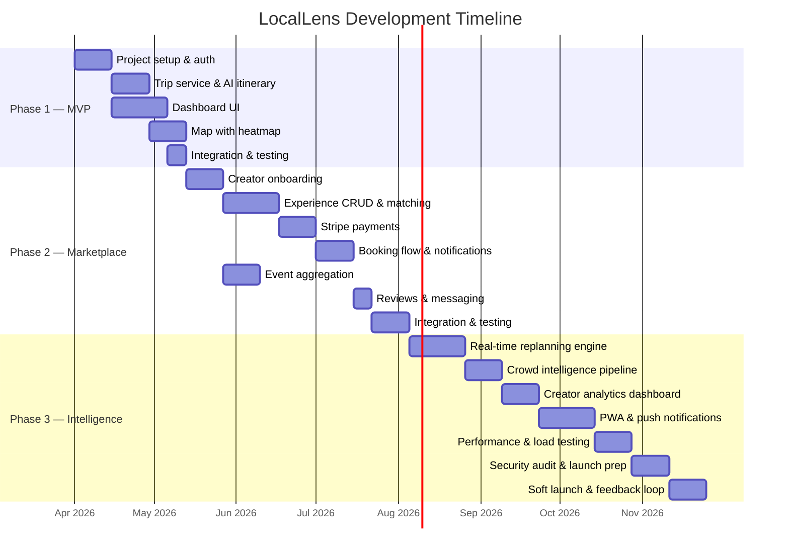

# LocalLens — Development Roadmap

---

## Phase Overview



---

## Phase 1 — MVP (8 Weeks)

**Goal**: Users can create a trip, get an AI-generated itinerary, and view it on a dashboard with an interactive 3D map.

### Sprint 1–2: Foundation (Weeks 1–2)

| Task | Details |
|------|---------|
| Project scaffolding | Spring Boot 3.x + Gradle, React 18 + Vite, Docker Compose |
| MongoDB setup | Atlas cluster (or local Docker), all indexes from schema doc |
| Auth system | `AuthService` complete: register, login, JWT issue/refresh, Google OAuth 2.0 |
| Base frontend | Vite + React Router + Bootstrap 5, login/register pages, Zustand + React Query setup |
| API client | Axios instance with JWT interceptor, auto-refresh on 401 |
| CI/CD pipeline | GitHub Actions: build + test on PR, Docker build on main push |

**Tech Decisions**:
- Zustand over Redux (simpler, less boilerplate for this scale)
- Vite over CRA (10x faster HMR, native ESM)
- Gradle over Maven (better incremental build, Kotlin DSL)
- MapLibre GL JS over Mapbox (fully open-source, no token required for basic tiles)

### Sprint 3–4: Core Trip & AI (Weeks 3–4)

| Task | Details |
|------|---------|
| Trip CRUD | `TripService`: create, list, get, update, delete trips |
| Trip creation wizard | 4-step React wizard with validation |
| Claude API integration | `ItineraryAIService`: system prompt, generation, JSON parsing |
| Itinerary day storage | MongoDB persistence of parsed itinerary days |
| Async generation | WebSocket push of `ITINERARY_READY` event |
| Flight & accommodation | Manual entry UI + trip document updates |
| Document upload | GridFS upload/download for passport, tickets, etc. |

**Key Decisions**:
- Async itinerary generation (202 Accepted) because Claude calls take 10–20s
- WebSocket (STOMP/SockJS) for generation status push
- Claude `claude-sonnet-4-20250514` for cost/quality balance

### Sprint 5–7: Dashboard & Map (Weeks 5–7)

| Task | Details |
|------|---------|
| Dashboard layout | Bootstrap 5 grid, collapsible panels with @dnd-kit |
| Trip overview card | Dates, destination, budget gauge, weather widget |
| Itinerary timeline | Day tabs, activity cards with drag-to-reorder |
| Budget tracker | Category breakdown with progress bars |
| Local events panel | Static display (API aggregation in Phase 2) |
| Notes panel | Document list from GridFS |
| Dark mode | CSS custom properties toggle |
| Map integration | MapLibre GL JS base map |
| Heatmap layer | Deck.gl HeatmapLayer with static seed data |
| POI markers | Deck.gl IconLayer from MongoDB experiences |
| Route visualization | Deck.gl PathLayer from itinerary GPS coords |
| Map tooltips | Hover info for POIs |

### Sprint 8: Integration & QA (Week 8)

| Task | Details |
|------|---------|
| End-to-end flow | Full trip creation → AI generation → dashboard display |
| Responsive testing | Mobile, tablet, desktop breakpoints |
| Performance | Lighthouse audit, lazy loading, code splitting |
| Bug fixes | Critical path bug fixing |
| Documentation | API docs (Swagger/OpenAPI), README |

**Phase 1 Deliverable**: Working MVP where a user can sign up, create a trip, receive an AI itinerary, view it on a dashboard with interactive map.

---

## Phase 2 — Marketplace (12 Weeks)

**Goal**: Two-sided marketplace with creator onboarding, experience booking, Stripe payments, event aggregation, and messaging.

### Sprint 1–2: Creator System (Weeks 9–10)

| Task | Details |
|------|---------|
| Creator registration | Role-based signup, creator profile fields |
| Experience CRUD | Create, edit, archive experiences with media upload |
| Availability calendar | Recurring + one-off slots with React calendar component |
| Creator dashboard skeleton | Bookings list, earnings placeholder |

### Sprint 3–5: Matching & Booking (Weeks 11–13)

| Task | Details |
|------|---------|
| Experience search | Geo-search, category filter, price range, sort by rating/distance |
| Experience detail page | Full page with gallery, reviews, booking CTA |
| `ExperienceMatchingService` | Scoring algorithm with weighted criteria |
| AI injection | Pass matched experiences to Claude for [LOCAL PICK] injection |
| Booking flow | Date/time selection, group size, special requests |

### Sprint 6–7: Payments (Weeks 14–15)

| Task | Details |
|------|---------|
| Stripe integration | PaymentIntent creation, webhook handler |
| Stripe Connect | Creator onboarding, payout after completed booking |
| Commission logic | Configurable platform fee (default 15%) |
| Refund handling | Full/partial refund on cancellation |
| Payment UI | Stripe Elements integration in React |

### Sprint 8–9: Notifications & Events (Weeks 16–17)

| Task | Details |
|------|---------|
| Notification system | In-app (WebSocket push), email (SendGrid) |
| Booking notifications | Confirmed, declined, cancelled, reminder |
| Eventbrite integration | `EventAggregatorService` nightly batch + hourly refresh |
| Event feed UI | Tonight's events, filtered by destination + dates |
| Creator events | Manual event submission |

### Sprint 10: Reviews & Messaging (Week 18)

| Task | Details |
|------|---------|
| Review system | Post-experience reviews with ratings + photos |
| Rating aggregation | Update experience + creator ratings on new review |
| Direct messaging | STOMP-based real-time chat between traveler ↔ creator |
| Message inbox UI | Conversation list, chat window |

### Sprint 11–12: Integration & QA (Weeks 19–20)

| Task | Details |
|------|---------|
| End-to-end marketplace flow | Browse → book → pay → review |
| Creator dashboard complete | Earnings chart, booking management, AI stats |
| Payment testing | Test mode with Stripe test keys |
| Load testing | JMeter for API endpoints |
| Security review | OWASP top 10 check, penetration testing |

**Phase 2 Deliverable**: Full marketplace with creator profiles, experience listings, Stripe payments, event feed, reviews, and messaging.

---

## Phase 3 — Intelligence (16 Weeks)

**Goal**: Real-time dynamic replanning, live crowd intelligence, creator analytics, PWA, and production hardening.

### Sprint 1–3: Replanning Engine (Weeks 21–23)

| Task | Details |
|------|---------|
| Weather scheduler | Poll OpenWeatherMap every 30 min for active trip destinations |
| Traffic scheduler | Poll TomTom every 15 min for upcoming activity routes |
| Venue status checker | Google Places operational status hourly |
| Replan orchestrator | Trigger → fetch context → Claude replan → diff → push |
| Replan logging | Full audit trail in `replan_logs` collection |
| Replan UI | Toast notification, diff modal (old vs new side-by-side) |
| Accept/reject flow | User can keep original or accept replan |
| Manual replan | User-initiated replan for specific slots |

### Sprint 4–5: Crowd Intelligence (Weeks 24–25)

| Task | Details |
|------|---------|
| Footfall service | Anonymous visit logging, grid aggregation |
| Heatmap computation | 30-min precompute, GeoJSON grid, Redis cache |
| Time slider | Filter heatmap by hour of day |
| Crowd level badges | LOW/MODERATE/HIGH/VERY_HIGH on POI tooltips |
| Best-time recommendation | Algorithm based on historical footfall patterns |
| Traffic overlay | Deck.gl TripsLayer with TomTom real-time data |
| Hidden gems layer | ScatterplotLayer for creator-tagged undiscovered spots |

### Sprint 6–7: Creator Analytics (Weeks 26–27)

| Task | Details |
|------|---------|
| AI injection stats | Track which itineraries included creator experiences |
| Visibility dashboard | Charts: impressions, bookings, conversion rate |
| Earnings analytics | Revenue by period, comparison charts |
| Platform admin panel | Total GMV, active users, popular destinations |

### Sprint 8–10: PWA & Push (Weeks 28–30)

| Task | Details |
|------|---------|
| PWA manifest | Installable web app with offline support |
| Service worker | Cache-first for static, network-first for API |
| Firebase Cloud Messaging | Push notifications for replan alerts, booking updates |
| Offline itinerary | Cache current trip itinerary for offline viewing |
| Mobile responsive | Touch-optimized timeline, bottom nav, swipe gestures |

### Sprint 11–12: Performance & Security (Weeks 31–32)

| Task | Details |
|------|---------|
| Load testing | K6/JMeter: 1000 concurrent users, WebSocket stress test |
| Database optimization | Query profiling, index tuning, aggregation pipelines |
| CDN setup | Cloudflare for static assets + API caching headers |
| Rate limiting | Bucket4j on Claude API calls, auth endpoints |
| Security audit | Dependencies (Snyk), OWASP ZAP, Stripe PCI compliance |

### Sprint 13–14: Launch Prep (Weeks 33–34)

| Task | Details |
|------|---------|
| Staging environment | Production-mirror on Railway |
| Data seeding | Sample creators, experiences, events for 5 cities |
| Monitoring | Spring Actuator + Prometheus + Grafana dashboards |
| Error tracking | Sentry for frontend + backend |
| Documentation | API docs (OpenAPI), creator onboarding guide, user guide |

### Sprint 15–16: Soft Launch (Weeks 35–36)

| Task | Details |
|------|---------|
| Beta testing | 50 travelers + 10 creators in 2 pilot cities |
| Feedback collection | In-app feedback widget, user interviews |
| Bug fixing | Priority P0/P1 bug resolution |
| Performance tuning | Based on real-world monitoring data |

---

## Testing Strategy

### Backend (Spring Boot)

| Layer | Tool | Coverage Target |
|-------|------|----------------|
| Unit tests | JUnit 5 + Mockito | All service methods, 80%+ line coverage |
| Integration tests | Spring Boot Test + Testcontainers | Repository queries, WebSocket, external API mocks |
| API tests | MockMvc + REST Assured | All controller endpoints |
| Contract tests | Spring Cloud Contract | API backward compatibility |

```bash
# Run all backend tests
./gradlew test

# Run with coverage
./gradlew test jacocoTestReport
```

### Frontend (React)

| Layer | Tool | Coverage Target |
|-------|------|----------------|
| Unit tests | Jest + React Testing Library | All components + hooks, 75%+ |
| Integration tests | Jest + MSW (Mock Service Worker) | API integration flows |
| E2E tests | Playwright | Critical user journeys (5 scenarios) |
| Visual regression | Storybook + Chromatic | Component gallery |

```bash
# Run all frontend tests
npm test -- --watchAll=false --coverage

# E2E
npx playwright test
```

### API Testing

| Tool | Purpose |
|------|---------|
| Postman collections | Manual API testing + CI automation |
| Newman | Run Postman collections in GitHub Actions |
| Swagger UI | Interactive API documentation at `/swagger-ui.html` |

### E2E Test Scenarios

1. **New Trip Flow**: Register → Create trip → Generate itinerary → View dashboard
2. **Booking Flow**: Browse experiences → View detail → Book → Pay → Receive confirmation
3. **Creator Flow**: Register as creator → Create experience → Receive booking → Accept → Get payout
4. **Replan Flow**: Trigger weather replan → View diff → Accept changes
5. **Map Flow**: Open map → Filter by time → Hover POI → Add to itinerary

---

## Team Structure (Suggested)

| Role | Count | Responsibility |
|------|-------|----------------|
| Tech Lead / Architect | 1 | Architecture decisions, code review, Claude prompt engineering |
| Backend Engineer | 2 | Spring Boot services, MongoDB, external API integrations |
| Frontend Engineer | 2 | React dashboard, map, marketplace UI |
| Full-stack Engineer | 1 | WebSocket layer, notifications, DevOps |
| UI/UX Designer | 1 | Design system, user flows, Figma prototypes |
| QA Engineer | 1 | Testing strategy, E2E automation, performance testing |

---

## Risk Mitigation

| Risk | Mitigation |
|------|-----------|
| Claude API cost overruns | Token budget per trip, cache repeated destinations, fallback to cheaper model |
| Claude response parsing failures | Strict JSON schema validation, retry with adjusted prompt, manual fallback |
| WebSocket scaling | Redis pub/sub for multi-instance, sticky sessions as fallback |
| Stripe Connect complexity | Start with standard accounts (easiest), upgrade to custom for more control |
| Map tile costs | MapLibre GL JS (free) + OpenStreetMap tiles (free), Mapbox only if needed |
| MongoDB performance at scale | Proper indexing, read replicas, time-series for footfall data |
| External API rate limits | Redis-based rate limiter, request queueing, graceful degradation |
