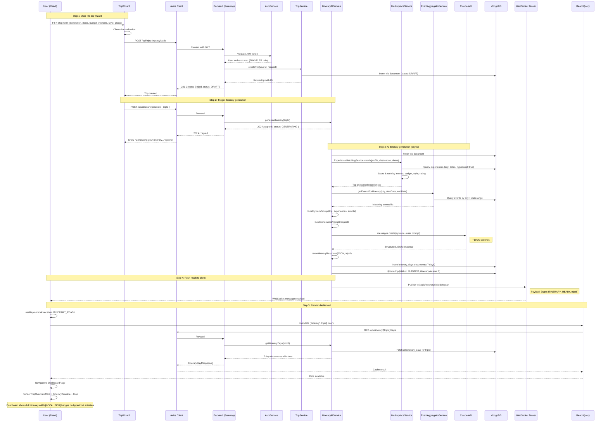
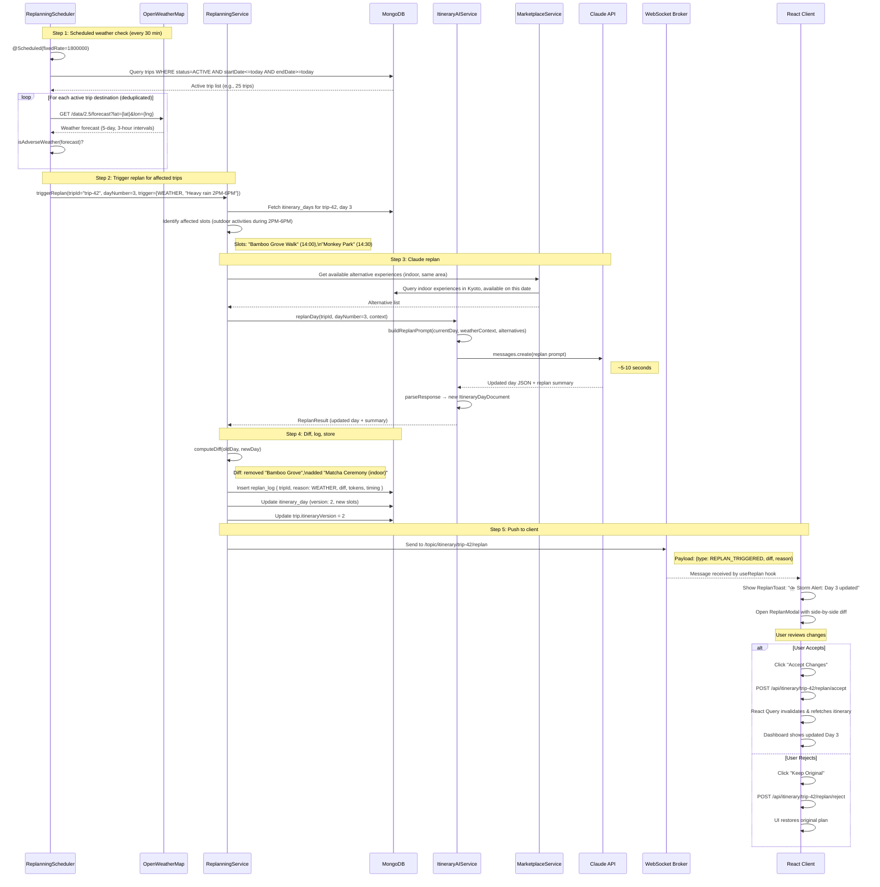

# LocalLens — End-to-End Flows & Project Structure

---

## End-to-End Flow: Scenario A — New Trip Creation



### Technical Details — Scenario A

| Step | Latency | Notes |
|------|---------|-------|
| Trip creation (POST) | ~100ms | Simple MongoDB insert |
| Generate trigger (POST) | ~50ms | Returns 202 immediately, spawns async task |
| Experience matching | ~200ms | MongoDB geo-query + in-memory scoring |
| Event fetching | ~100ms | MongoDB query, Redis-cached if available |
| Claude API call | 10–20s | Main bottleneck, depends on trip length |
| Parse + store | ~300ms | JSON parse + 7 MongoDB inserts |
| WebSocket push | ~10ms | STOMP message to subscribed client |
| Dashboard render | ~500ms | React Query fetch + Deck.gl map init |
| **Total** | **~12–22s** | User sees spinner, then full dashboard |

---

## End-to-End Flow: Scenario B — Dynamic Replan



---

## Complete Project Structure

```
locallens/                                    # Monorepo root
├── .github/
│   └── workflows/
│       └── ci-cd.yml                         # GitHub Actions pipeline
├── docker/
│   └── mongo-init.js                         # MongoDB initialization script
├── docker-compose.yml                        # Local development
├── docker-compose.prod.yml                   # Production overrides
├── .env.example                              # Environment variables template
├── README.md                                 # Project overview
│
├── locallens-backend/                        # Spring Boot Application
│   ├── Dockerfile
│   ├── build.gradle                          # Gradle build config
│   ├── settings.gradle
│   ├── gradlew / gradlew.bat
│   ├── gradle/
│   │   └── wrapper/
│   └── src/
│       ├── main/
│       │   ├── java/com/locallens/
│       │   │   ├── LocalLensApplication.java
│       │   │   │
│       │   │   ├── config/
│       │   │   │   ├── SecurityConfig.java
│       │   │   │   ├── WebSocketConfig.java
│       │   │   │   ├── MongoConfig.java
│       │   │   │   ├── RedisConfig.java
│       │   │   │   ├── StripeConfig.java
│       │   │   │   ├── CorsConfig.java
│       │   │   │   └── SwaggerConfig.java
│       │   │   │
│       │   │   ├── common/
│       │   │   │   ├── dto/
│       │   │   │   │   ├── ApiResponse.java
│       │   │   │   │   ├── PageResponse.java
│       │   │   │   │   └── GeoPoint.java
│       │   │   │   ├── exception/
│       │   │   │   │   ├── GlobalExceptionHandler.java
│       │   │   │   │   ├── ResourceNotFoundException.java
│       │   │   │   │   ├── UnauthorizedException.java
│       │   │   │   │   └── BadRequestException.java
│       │   │   │   └── util/
│       │   │   │       ├── JwtTokenProvider.java
│       │   │   │       └── CurrencyUtils.java
│       │   │   │
│       │   │   ├── auth/
│       │   │   │   ├── controller/AuthController.java
│       │   │   │   ├── service/AuthService.java
│       │   │   │   ├── service/OAuth2Service.java
│       │   │   │   ├── security/JwtAuthenticationFilter.java
│       │   │   │   ├── security/UserPrincipal.java
│       │   │   │   ├── dto/RegisterRequest.java
│       │   │   │   ├── dto/LoginRequest.java
│       │   │   │   ├── dto/AuthResponse.java
│       │   │   │   ├── dto/UserProfileResponse.java
│       │   │   │   ├── repository/UserRepository.java
│       │   │   │   └── model/UserDocument.java
│       │   │   │
│       │   │   ├── trip/
│       │   │   │   ├── controller/TripController.java
│       │   │   │   ├── service/TripService.java
│       │   │   │   ├── dto/ (CreateTripRequest, TripResponse, ...)
│       │   │   │   ├── repository/TripRepository.java
│       │   │   │   └── model/TripDocument.java
│       │   │   │
│       │   │   ├── itinerary/
│       │   │   │   ├── controller/ItineraryController.java
│       │   │   │   ├── service/ItineraryAIService.java
│       │   │   │   ├── service/ClaudeApiClient.java
│       │   │   │   ├── service/PromptBuilder.java
│       │   │   │   ├── service/ItineraryParser.java
│       │   │   │   ├── dto/ (GenerateRequest, ItineraryDayResponse, ...)
│       │   │   │   ├── repository/ItineraryDayRepository.java
│       │   │   │   └── model/ItineraryDayDocument.java
│       │   │   │
│       │   │   ├── replan/
│       │   │   │   ├── service/ReplanningService.java
│       │   │   │   ├── service/ReplanningScheduler.java
│       │   │   │   ├── client/WeatherClient.java
│       │   │   │   ├── client/TrafficClient.java
│       │   │   │   ├── client/VenueStatusClient.java
│       │   │   │   ├── dto/ (ReplanContext, DiffPayload, ...)
│       │   │   │   ├── repository/ReplanLogRepository.java
│       │   │   │   └── model/ReplanLogDocument.java
│       │   │   │
│       │   │   ├── marketplace/
│       │   │   │   ├── controller/ExperienceController.java
│       │   │   │   ├── controller/CreatorController.java
│       │   │   │   ├── service/MarketplaceService.java
│       │   │   │   ├── service/ExperienceMatchingService.java
│       │   │   │   ├── dto/ (ExperienceResponse, BookingRequest, ...)
│       │   │   │   ├── repository/ExperienceRepository.java
│       │   │   │   ├── repository/BookingRepository.java
│       │   │   │   ├── repository/ReviewRepository.java
│       │   │   │   ├── model/ExperienceDocument.java
│       │   │   │   ├── model/BookingDocument.java
│       │   │   │   └── model/ReviewDocument.java
│       │   │   │
│       │   │   ├── payment/
│       │   │   │   ├── controller/PaymentController.java
│       │   │   │   ├── service/PaymentService.java
│       │   │   │   └── dto/ (PaymentIntentResponse, ...)
│       │   │   │
│       │   │   ├── map/
│       │   │   │   ├── controller/MapController.java
│       │   │   │   ├── service/FootfallService.java
│       │   │   │   ├── service/HeatmapScheduler.java
│       │   │   │   ├── dto/ (HeatmapResponse, POIResponse, ...)
│       │   │   │   ├── repository/FootfallGridRepository.java
│       │   │   │   └── model/FootfallGridDocument.java
│       │   │   │
│       │   │   ├── event/
│       │   │   │   ├── controller/EventController.java
│       │   │   │   ├── service/EventAggregatorService.java
│       │   │   │   ├── client/EventbriteClient.java
│       │   │   │   ├── dto/ (EventResponse, ...)
│       │   │   │   ├── repository/EventRepository.java
│       │   │   │   └── model/EventDocument.java
│       │   │   │
│       │   │   ├── notification/
│       │   │   │   ├── controller/NotificationController.java
│       │   │   │   ├── service/NotificationService.java
│       │   │   │   ├── client/SendGridClient.java
│       │   │   │   ├── client/FirebaseClient.java
│       │   │   │   ├── dto/ (NotificationResponse, ...)
│       │   │   │   ├── repository/NotificationRepository.java
│       │   │   │   └── model/NotificationDocument.java
│       │   │   │
│       │   │   ├── analytics/
│       │   │   │   ├── controller/AnalyticsController.java
│       │   │   │   ├── service/AnalyticsService.java
│       │   │   │   └── dto/ (CreatorVisibilityResponse, ...)
│       │   │   │
│       │   │   └── messaging/
│       │   │       ├── controller/MessageController.java
│       │   │       ├── service/MessageService.java
│       │   │       ├── repository/MessageRepository.java
│       │   │       └── model/MessageDocument.java
│       │   │
│       │   └── resources/
│       │       ├── application.yml
│       │       ├── application-docker.yml
│       │       ├── application-test.yml
│       │       └── prompts/
│       │           ├── itinerary-system.txt
│       │           ├── itinerary-user.txt
│       │           └── replan-user.txt
│       │
│       └── test/
│           └── java/com/locallens/
│               ├── auth/service/AuthServiceTest.java
│               ├── trip/service/TripServiceTest.java
│               ├── itinerary/service/ItineraryAIServiceTest.java
│               ├── replan/service/ReplanningServiceTest.java
│               ├── marketplace/service/ExperienceMatchingServiceTest.java
│               └── integration/
│                   ├── TripIntegrationTest.java
│                   └── ItineraryIntegrationTest.java
│
├── locallens-frontend/                       # React Application
│   ├── Dockerfile
│   ├── Dockerfile.dev
│   ├── docker/nginx.conf
│   ├── package.json
│   ├── vite.config.js
│   ├── .env.example
│   ├── public/
│   │   ├── index.html
│   │   ├── favicon.ico
│   │   └── manifest.json
│   └── src/
│       ├── index.js
│       ├── App.jsx
│       ├── components/
│       │   ├── common/     (17 shared UI components)
│       │   ├── auth/       (4 auth components)
│       │   ├── trip/       (6 trip wizard components)
│       │   ├── dashboard/  (13 dashboard components)
│       │   ├── map/        (10 map components)
│       │   ├── marketplace/ (8 marketplace components)
│       │   ├── creator/    (8 creator components)
│       │   └── messaging/  (3 messaging components)
│       ├── pages/          (13 page components)
│       ├── hooks/          (14 custom hooks)
│       ├── services/       (12 API service modules)
│       ├── store/          (5 Zustand stores)
│       ├── utils/          (4 utility modules)
│       └── styles/         (6 CSS files)
│
└── docs/
    ├── architecture.md
    ├── api-docs.md
    ├── creator-guide.md
    └── deployment.md
```

### Component Count Summary

| Area | Files |
|------|-------|
| Backend Java classes | ~85 |
| Frontend React components | ~69 |
| Hooks | 14 |
| Services | 12 |
| Stores | 5 |
| CSS files | 6 |
| Config/Docker | ~12 |
| Tests (backend) | ~20 |
| **Total** | **~223 files** |
